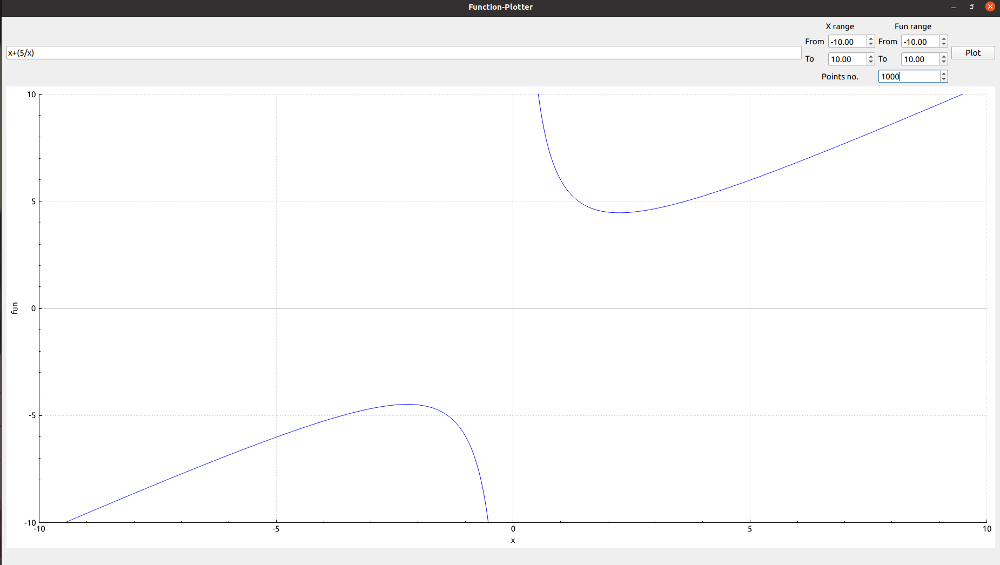
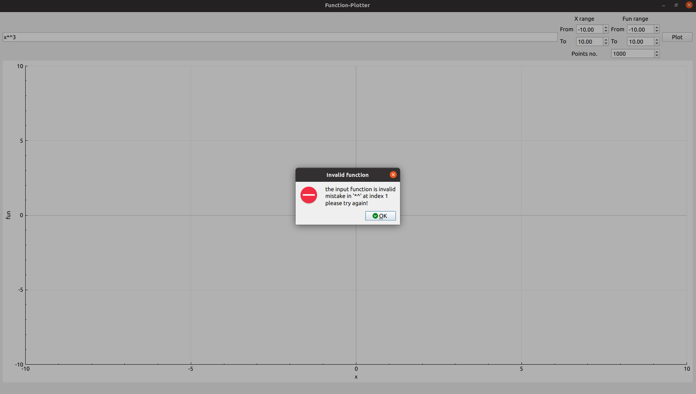

# Function-Plotter

GUI application to plot polynomial functions.

---

# What can it do

1. you can plot any arbitrary user-entered function.

2. the input expression must be  function, e.g., 5\*x^3+2\*x

3. the input expression must has no spaces.

4. you can specify the min and max range for x and function.

5. the program first validated the input expression and display messages to explain any wrong input.

6. you can specify the number of points to be plotted which affect the smoothness of the curve.

# Snapshots

there is many snapshots of correct and wrong input examples in the [examples](examples) directory.

here's two of them

arbitrary function: 



wrong successive brackets:



# Building steps

This project uses [Make](https://www.gnu.org/software/make/) building tool with [QMake](https://doc.qt.io/qt-5/qmake-manual.html) to automate the generation Make building files.

After cloning the repo

```bash
git clone https://github.com/MustafaAmer-1/Function-Plotter.git
```

It's recommended to build this project with Qtcreator to solve any dependency problems, by opening ([.pro](Function-Plotter.pro)) file then build and run the project comfortably.

## Manual build

To manually build this project you need qmake to be installed with QT library configured.

create clean building directory

```bash
mkdir build
cd build
qmake ..
# compile
make
```

then run the executable as follows

```bash
./Function-Plotter
```

# Testing

the project has been tested by [QTest](https://doc.qt.io/qt-5/qtest-overview.html) framework, including the testing source code in [AutoTestPlotter](AutoTestPlotter) project.
